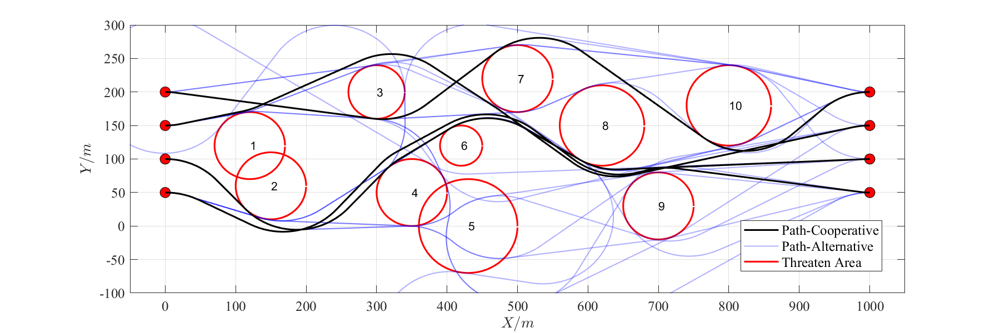

# UAV_Cooperative_Path_Planning

This repository provides a cooperative path-planning program based on multi-Dubins path segments to meet the penetration requirements of UAVs in a complex threat environment. The particle swarm optimization is adopted for the path length adjustment and collision avoidance requirements.

Please cite our paper if you use this project in your research:

* Z. Liu, Y. Liu, H. Zhao, H. Lu and M. Hao, "Multi-UAV Cooperative Path-Planning Under Complex Threat Environment," 2023 42nd Chinese Control Conference (CCC), Tianjin, China, 2023, pp. 5589-5594, doi: 10.23919/CCC58697.2023.10241081. 

The full paper can be downloaded at https://www.researchgate.net/publication/374016314_Multi-UAV_Cooperative_Path-Planning_Under_Complex_Threat_Environment

# Quick Start

This project was developed in MATLAB 2023a. This program does not use a particular toolbox and can be used in lower versions of MATLAB. The program usage steps are as follows:

1. First, clone this repository.

   ```
   git clone https://github.com/LiuZhenchang/UAV_Cooperative_Path_Planning.git
   ```

2. Open the UAV_Cooperative_Path_Planning folder in MATLAB.

3. Open the file "Demo1" and run the program. Based on the expected path length, the program can plan almost equal threat avoidance paths for each UAV. Change the value of "ideal_length" in line 51 to 6 * 1e5 and rerun the program. The results of the two runs are shown in the following figures.
   <p align="center">
     
     
   </p>
   
4. Open the file “Demo2” and run the program. The following figure shows the result, indicating that the program can be used in complex environments with multiple threat areas (obstacles).
   <p align="center">
     
   </p>

The method implemented in this repository can assist fixed-wing UAV swarms in disbanding the formation for distributed penetration when encountering threat areas or obstacles. Besides, it can help to reassemble the formation after the penetration is completed.

# License
The source code is released under [GPLv3](http://www.gnu.org/licenses/) license.

